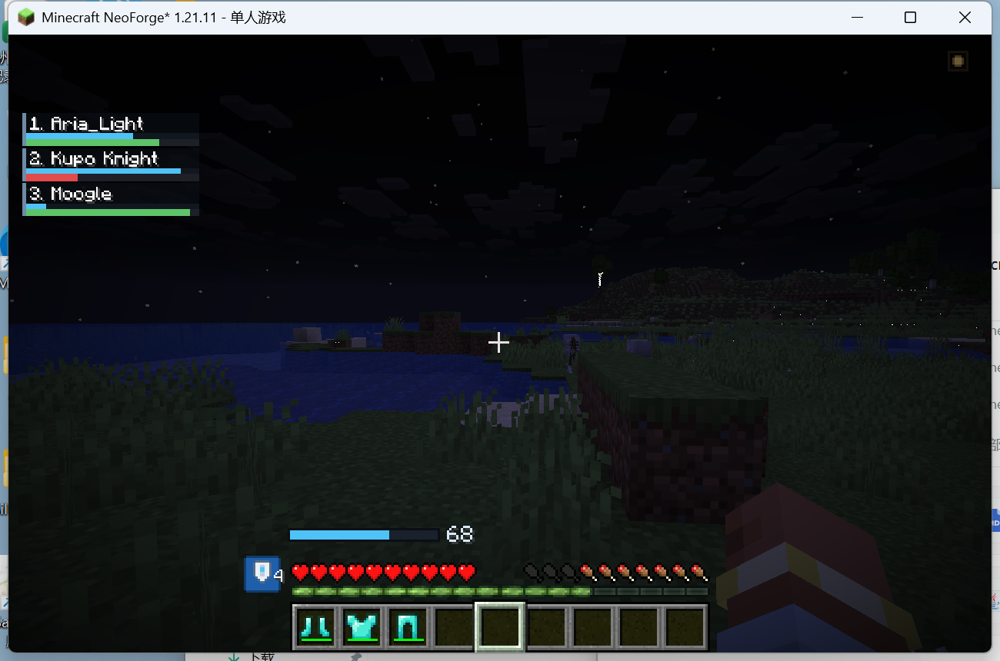
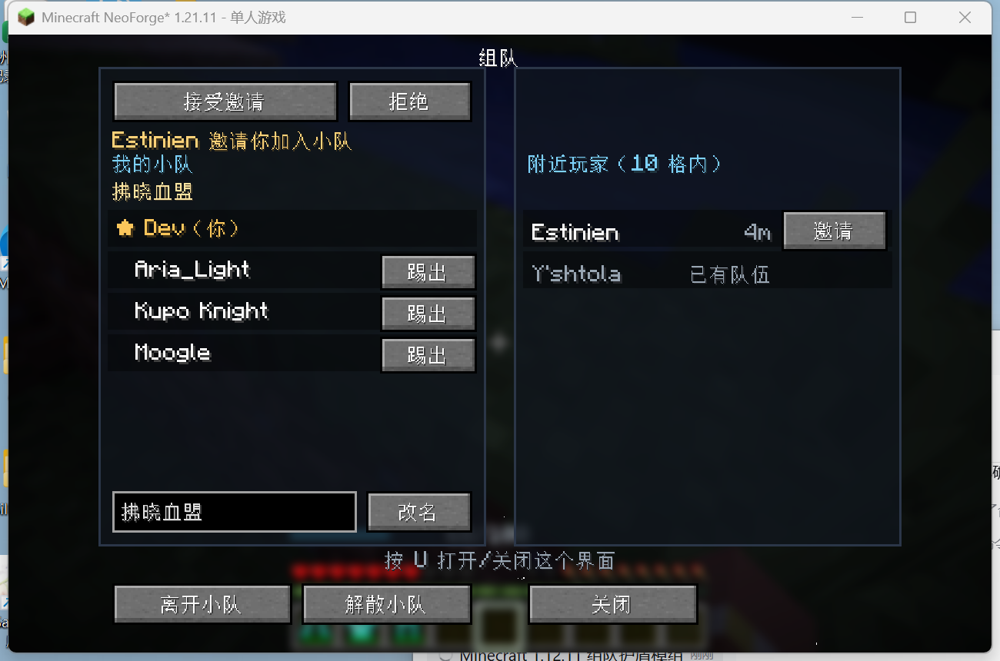
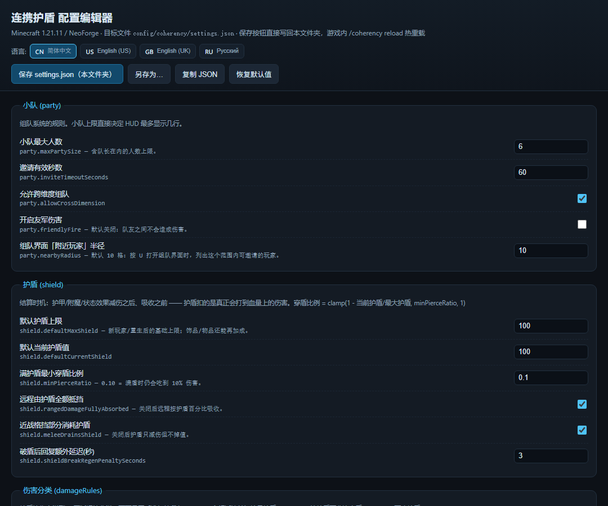
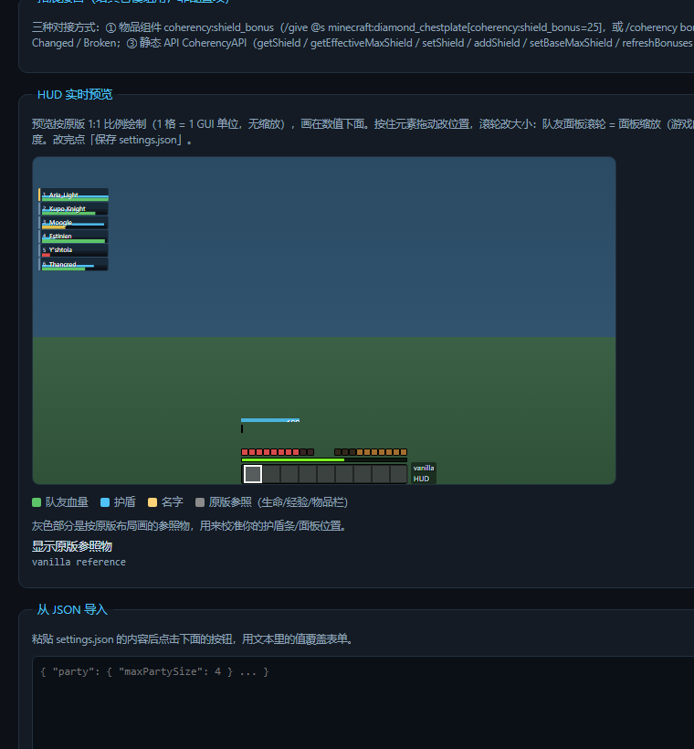

# Linked Shield v1.0.4

> Author: **blackcloc** · modid `linkedshield` · **Minecraft 1.21.11 + NeoForge 21.11.x**

**English** | [简体中文](README.md)

An FF14-style party system plus shield / Linked Shield regeneration mod, with a party UI modelled on FFXIV's minimalist teammate list.

- Shows teammate names + health bars at the **far left** of the screen (FF14 style: index number, gold side bar for the party leader, health gradient; distance is not shown)
- When a teammate has **status effects**, a row of **scaled-down effect icons** appears below their health bar (vanilla effect icons and colours, blinking under 10 seconds exactly like vanilla, scaled with the panel; up to 8 entries per teammate)
- Your own shield bar is drawn **directly above your health bar**; while Linked Shield is active a **blue shield icon** appears to the left of the health bar (the number in its bottom-right corner is the link count, including yourself)
- **Projectiles** and **damage over time** (fire / lava / poison / wither / freeze), plus **magic and sonic attacks** (e.g. Warden sonic boom, Guardian laser) are fully absorbed by the shield; **melee** and **explosions** pierce the shield by a percentage
- Resolution happens *after* armour and enchantment reduction, so the shield never pays for your armour
- **Party linking**: once the link count is > 1 and stays that way for **2 seconds**, the shield starts regenerating automatically — faster with more nearby teammates (radius 10 blocks; out-of-combat is no longer required by default, where out-of-combat = 2 seconds after taking damage)
- **Friendly fire immunity**: `party.friendlyFire` defaults to false — players in the same party cannot damage each other (damage is cancelled *before* armour is applied, so not even the "in combat" tag is set); set it to true to allow friendly fire
- Press **U** to open the party screen: party name + party members (yourself marked as "(You)") + one-click invites for players within 10 blocks
- When you receive an invite a small dot appears in the top-right corner; accept or decline directly in the screen
- On first launch it generates `settings.json` in `config/linkedshield/` together with a **clickable HTML config editor**

---

## 1. Environment and build

| Item | Version |
| --- | --- |
| Minecraft | 1.21.11 |
| NeoForge | 21.11.45 (`neo_version` in `gradle.properties`) |
| Java | 21 (required — Mojang already uses 21 in 1.21.11) |
| Gradle | 9.6 (wrapper included in the project) |
| Build plugin | ModDevGradle 2.0.148 |
| Mappings | Parchment 1.21.11 / 2025.12.20 |

Open this directory directly in IntelliJ IDEA (it is a Gradle project); once the sync finishes you can run:

```bash
./gradlew build          # compile and package build/libs/linkedshield-1.0.4.jar
./gradlew runClient      # launch the client with the mod
./gradlew runServer      # launch the server with the mod (--nogui)
./gradlew runSelfTest    # unattended self-test: runs all shield/party/config/damage-classification checks, then shuts down
./gradlew runHudDemo     # preview the HUD layout in singleplayer (fake teammates + fake invite)
./gradlew runHudDemo -PquickPlayWorld=world              # preview and jump straight into the world named "world"
./gradlew runHudDemo -PquickPlayWorld=world -PguiDemo    # auto-open the party screen once in-world (for screenshots)
./gradlew runHudDemo -PquickPlayWorld=world -PdamageTest # also run the real damage-pipeline probe (measured health/shield loss goes to chat)
```

> `runSelfTest` starts the server with `-Dlinkedshield.selftest=true` and, 40 ticks after joining, runs **170 assertions**
> (config generation, default values, language-file conventions, clickable links, party add/remove/rename, same-party checks, **friendly-fire immunity**,
> saved-data codec round trips, UI/action payload round trips (including the effect list), the pierce formula,
> the 2-second out-of-combat / link start conditions, the classification and seven handling modes of 50 damage types, and the extension API / item component).
> The log prints `[LinkedShield][SELFTEST] PASSED all 170 checks`; any failing check exits with code 1 and fails the Gradle task.
>
> `-PdamageTest` uses `-Dlinkedshield.damagetest=true`: after the player joins it **really deals 17 groups of damage plus 1 API test**,
> prints the measured "health loss / shield loss" to the log and chat, and asserts 38 checks.

### What it actually looks like

| In-game HUD (shield icon + link count) | Party screen (press U) | Config editor: values on top | Editor: 1:1 preview below + vanilla reference |
| --- | --- | --- | --- |
|  |  |  |  |

First image: the teammate panel sits in the top-left (smaller, no distance), a **blue shield icon** is to the left of the health bar, the number 4 in its bottom-right corner is the link count (3 teammates + yourself),
the invite dot is in the top-right, and the shield bar sits above the health bar (showing **only the live value, 68** — no maximum, no percentage).
Second image: the party screen — "My Party" on the left (party name + yourself as "(You)" + party members + kick/rename/leave/disband),
"Nearby Players (within 10 blocks)" on the right (invite / already in a party), and the invite banner's accept/decline buttons at the top; the screen shows neither health bars nor shield values.
The last two images: `config_editor.html`, generated on first launch — all values at the top, with the **HUD preview below the values**,
drawn at true 1:1 vanilla coordinates (health/hunger/experience/hotbar are the reference objects); the 🇨🇳 / 🇺🇸 / 🇬🇧 / 🇷🇺 flag buttons in the top-right corner
switch the entire text to another language instantly (`docs/config-editor-ru.png` is the same page in Russian).

---

## 2. Configuration (HTML editor)

On first launch the following files are generated inside the **game directory**:

```
config/linkedshield/settings.json        ← the single source of truth (JSON)
config/linkedshield/config_editor.html   ← the visual config editor
```

How to open it (pick one):

1. Run `/linkedshield config` in game and click the file name in chat (works in singleplayer / on a LAN host)
2. Go to `config/linkedshield/` and double-click `config_editor.html`

> Since 1.0.2 the mod **no longer prints anything to chat when you join a world** (early versions printed a clickable link to the config page).
> You can open the config page at any time using the methods above; if you want a reminder on every join, add your own datapack / command block.

What the editor lets you change (with a live HUD preview):

| Option | Description | Default |
| --- | --- | --- |
| `party.maxPartySize` | Maximum party size | 6 |
| `shield.defaultMaxShield` / `defaultCurrentShield` | Default shield maximum / current value | 100 / 100 |
| `shield.minPierceRatio` | Forced pierce ratio at full shield | 0.10 |
| `shield.rangedDamageFullyAbsorbed` | Whether ranged damage is fully absorbed by the shield | true |
| `shield.meleeDrainsShield` | Whether the blocked portion still drains the shield for melee / percentage pierce | true |
| `shield.shieldBreakRegenPenaltySeconds` | Extra regen delay after the shield breaks | 3 |
| `damageRules.projectileBehavior` | Ranged (projectiles / lightning / thorns) handling: `FULL` / `PIERCE` / `NONE` | FULL |
| `damageRules.dotBehavior` | Damage over time (fire / lava / poison / wither / freeze) | FULL (as ranged) |
| `damageRules.meleeBehavior` | Melee (attacks / contact / impact / falling objects) handling | PIERCE |
| `damageRules.explosionBehavior` | Explosion handling (same formula as melee) | PIERCE |
| `damageRules.magicBehavior` | Magic / sonic (Guardian laser, Warden sonic boom, dragon breath) handling | FULL (as ranged) |
| `damageRules.environmentBehavior` | Environmental damage (drowning / starvation / suffocation / out of world, etc.) | NONE |
| `damageRules.otherBehavior` | Unrecognised damage handling | NONE |
| `damageRules.extraProjectileTypes` / `extraMeleeTypes` / `extraDotTypes` | Extra damage types to classify (comma separated) | `minecraft:spit` / empty / empty |
| `damageRules.fallbackToEntityType` | Whether unrecognised types fall back to "direct entity" detection | true |
| `party.nearbyRadius` | Radius (blocks) for "Nearby Players" in the party screen | 10 |
| `party.friendlyFire` | Whether friendly fire is **allowed** (false = party members are immune to each other, not even a combat tag) | false |
| `hud.partyList.scale` | Overall scale of the teammate panel (name font scales with it) | 0.8 |
| `hud.partyList.rowWidth` / `rowHeight` | Teammate row size (before scaling) | 96 / 18 |
| `linkedshield.rateOneMember` / `rateTwoMembers` / `rateThreeOrMore` | Link regen rate (points/second) | 2.5 / 3.75 / 5.0 |
| `linkedshield.soloRate` | Solo (no teammates) regen rate; 0 = only regen with teammates nearby | 0 |
| `linkedshield.radius` | Link detection radius | 10 blocks |
| `linkedshield.startDelaySeconds` | How many seconds the link count must stay &gt; 1 before regen starts | 2 |
| `linkedshield.requireOutOfCombat` | Whether being out of combat is still required for regen | false |
| `linkedshield.outOfCombatDelaySeconds` | How long after combat regen may start | 2 seconds |
| `linkedshield.requireSameDimension` | Whether the same dimension is required | true |
| `combat.combatTagSeconds` | Out-of-combat rule: **seconds after the last damage taken** | 2 seconds |
| `hud.partyList.*` | Teammate panel: edge (default **LEFT**), offset, row width/height, **name position**, shield bar, index numbers, background alpha, sorting | left / name above the health bar |
| `hud.selfShield.*` | Own shield bar: **position** (above/below the health bar, above the hotbar, custom), offset, width/height, text position, colours, number format (default **CURRENT = live value only**) | above the health bar / 68 |
| `hud.linkedshieldIcon.*` | Link icon: visibility, scale, offset, whether to show the count | shown / 1.0 / 0 / shown |

After saving:

- Singleplayer: `/linkedshield reload` hot-reloads it (no restart needed)
- Multiplayer: the host/server edits its own `config/linkedshield/settings.json`, then `/linkedshield reload`

> HTML save behaviour (since 1.0.3): **Save settings.json** writes **straight back into the folder the HTML file lives in** (`config/linkedshield/`).
> Browser security requires one initial "allow access to folder" click; after that the browser remembers it, and later saves write silently without a prompt.
> To save somewhere else use **Save as…** (which goes through the system file dialog). Browsers without the File System Access API (e.g. Firefox) fall back to a download.

**Live HUD preview** (since 1.0.3 it sits below all the values, at a **true 1:1 vanilla scale with no zooming**):

The preview is a plain **GUI-unit coordinate space** (1 block = 1 GUI unit, canvas 640×360 GUI units, i.e. a 1920×1080 window at GUI scale 3),
so a value of 1px really is 1px in the preview and lines up perfectly with the game. You can:

- **Drag the teammate panel** → changes `hud.partyList.offsetX / offsetY` (the offset direction flips automatically when the panel is anchored to the right edge)
- **Drag the shield bar** → changes `hud.selfShield.offsetX / offsetY`
- **Scroll on the teammate panel** → changes `hud.partyList.scale` (the same in-game panel scale, not a preview zoom)
- **Scroll on the shield bar** → changes `hud.selfShield.width`; **Shift + scroll** → changes `hud.selfShield.height`
- Drag/scroll results are written back into the form fields live; click **Save settings.json** to write them into this folder, then `/linkedshield reload` to apply

**Vanilla reference objects (for calibrating positions)**: the preview draws the **health bar, hunger bar, experience bar and hotbar (9 slots + selection frame)** using vanilla layout,
marked in grey as `vanilla HUD`. Because the shield bar anchors are computed from vanilla coordinates (`x = screenWidth/2 - 91`, health bar at `screenHeight - 39`,
hotbar 182×22 flush with the bottom), you can drag/scroll against them to place the shield bar exactly "above the health bar / below the health bar / above the hotbar".
The checkbox in the bottom-right corner hides these references at any time.

**Localisation (click a flag to switch)**: the editor UI text comes from the mod's own language files, and there are four flag buttons in the top-right:

| Flag | Language | Language file |
| --- | --- | --- |
| 🇨🇳 | Simplified Chinese | `lang/zh_cn.json` (complete) |
| 🇺🇸 | English (US) | `lang/en_us.json` (complete, **authoritative file**) |
| 🇬🇧 | English (UK) | `lang/en_gb.json` (only British differences: armour / colour / recognised…, everything else falls back to en_us) |
| 🇷🇺 | Русский | `lang/ru_ru.json` (complete) |

In-game commands, GUIs and key bindings cover the same four languages; when you open the config page in a browser it picks one based on your system language,
and you can switch manually with the flags at any time (missing keys fall back `en_us → zh_cn`).

---

## 3. Commands

Party commands (available to all players):

```
/party invite <player>    invite
/party accept             accept an invite
/party deny               decline an invite
/party leave              leave the party
/party kick <player>      leader kicks a member
/party disband            leader disbands the party
/party rename <name>      leader renames the party (max 24 characters, empty = default name)
/party list               list members (name / health / shield)
/party info               current shield (live value only), nearby teammate count, link rate, whether linking has started
```

Shield and config commands (require OP, permission level 2):

```
/linkedshield shield get [player]
/linkedshield shield set <value> [player]
/linkedshield shield max <value> [player]
/linkedshield bonus <value>            attach/change linkedshield:shield_bonus on the main-hand item (extension API debugging, 0 = remove)
/linkedshield reload                   re-read settings.json
/linkedshield config                   print a clickable link to the config page
/linkedshield damage                   list how each of the eight damage categories is handled
/linkedshield damage <damage type>     look up which category a damage type falls into (e.g. minecraft:sonic_boom)
```

---

## 4. Shield mechanics

### 4.0 Resolution timing (important)

The shield resolves in **`LivingDamageEvent.Pre`**, i.e. **after armour / enchantment / status-effect reduction and before absorption**:

```
raw damage → difficulty scaling → armour reduction → enchantment/resistance reduction → [shield resolution] → absorption (yellow hearts) → health loss
```

So the shield only pays the damage that would **actually reach your health**, and never pays for your armour:
the same 20-point melee hit drains 18 shield and 2 health with no armour, but only 7.2 shield and 0.8 health in full diamond (see section 7 for the measurements).

### 4.1 Damage classification (no longer "who hit me")

Classification is based on **damage type + vanilla tags** (`DamageSource#is(TagKey)`). Each category can be configured separately in `damageRules`:

| Mode | Meaning |
| --- | --- |
| `FULL` | The shield fully absorbs it: with enough shield you take no damage and the same amount is drained; otherwise the overflow hits your health |
| `PIERCE` | Pierces by shield percentage: `pierce ratio = clamp(1 - currentShield/maxShield, minPierceRatio, 1)` |
| `NONE` | Ignores the shield entirely and resolves exactly like vanilla |

### 4.2 Classification table (all 50 vanilla damage types in 1.21.11)

| Category | Default handling | Included damage types |
| --- | --- | --- |
| **Ranged** | `FULL` | `arrow`, `trident`, `mob_projectile`, `unattributed_fireball`, `fireball`, `wither_skull`, `thrown`, `wind_charge` (`#minecraft:is_projectile`) + `spit` (vanilla leaves it out of the tag, added via `extraProjectileTypes`) + `lightning_bolt` (lightning) + `thorns` (thorns damage) |
| **Damage over time** | `FULL` (as ranged) | `in_fire`, `on_fire`, `campfire`, `hot_floor`, `lava`, `magic` (poison / instant damage), `wither` (wither effect), `freeze` |
| **Magic / sonic** | `FULL` (as ranged) | `sonic_boom` (Warden sonic boom), `indirect_magic` (Guardian laser), `dragon_breath` |
| **Melee** | `PIERCE` | Attacks: `player_attack`, `mob_attack`, `mob_attack_no_aggro`, `mace_smash`, `sting`, `spear`<br>Contact / impact: `cactus`, `sweet_berry_bush`, `cramming`, `fall`, `ender_pearl`, `fly_into_wall`, `stalagmite`<br>Falling objects: `falling_anvil`, `falling_block`, `falling_stalactite` |
| **Explosion** | `PIERCE` (**same formula as melee**) | `explosion` (TNT / crystals / creepers), `player_explosion` (beds / respawn anchors), `bad_respawn_point`, `fireworks` |
| **Environment** | `NONE` | `drown`, `starve`, `in_wall`, `out_of_world`, `outside_border`, `generic`, `generic_kill`, `dry_out` |
| **Other / unrecognised** | `NONE` | Mod-defined types; with `fallbackToEntityType=true` these fall back to "direct entity" detection and become ranged/melee, so modded content never completely ignores the shield |

> Since 1.0.1 cactus, sweet berry bushes, cramming, fall damage, ender pearl impact, flying into a wall, stalagmites and falling objects are all part of **melee** (percentage pierce),
> while lightning and thorns damage are part of **ranged** (fully absorbed); the former separate "thorns" and "falling objects" categories are gone, leaving 7 categories in total.
> `spear` has no call site anywhere in the 1.21.11 vanilla code (it only exists in data files); it is classed as melee so that behaviour stays consistent when `/damage`, datapacks or mods use it.
> To check the in-game classification: `/linkedshield damage <damage type>` (e.g. `/linkedshield damage minecraft:sonic_boom`).

### 4.3 Melee / percentage pierce examples (`minPierceRatio = 0.10`)

| Current shield | Pierce ratio | Actual health loss from 100 damage |
| --- | --- | --- |
| 100% (full) | 10% (forced floor) | 10 |
| 90% | 10% | 10 |
| 50% | 50% | 50 |
| 10% | 90% | 90 |
| 0% (broken) | 100% | 100 |

### 4.4 Linked Shield regeneration

- Condition: same party, within `linkedshield.radius` (10 blocks by default), online and alive; with `requireSameDimension=true` the same dimension as well
- Rate: 2.5/s with 1 nearby teammate, 3.75/s with 2, 5/s with 3 or more (configurable)
- **Start condition (since 1.0.1)**: the link count must be **> 1** (at least 1 teammate nearby) and stay that way for **`startDelaySeconds` seconds (2 by default)** before regen begins;
  if someone leaves the radius midway the timer restarts. In addition, at least `shieldBreakRegenPenaltySeconds` (3 by default) must have passed since the last **shield break**
- Enabling `linkedshield.requireOutOfCombat` (default **false**) adds an out-of-combat requirement
  (more than `max(combatTagSeconds, outOfCombatDelaySeconds)` since the last damage taken; both default to **2 seconds**)
- The link icon (the blue shield left of the health bar) is active exactly while regen runs; the number in its bottom-right corner is the link count (including yourself)

### 4.5 Integration API for other mods (shield maximum extension)

The shield maximum has two layers: the **base maximum** (stored in player data and saved with the world) and **dynamic bonuses** (from trinkets/equipment/potions, etc.).
There are three integration paths for dynamic bonuses; pick whichever suits you:

**① Item component `linkedshield:shield_bonus`** — the simplest; it applies while the item is in your inventory/equipment slots (and stacks):

```java
// in your own mod's item
new Item.Properties().component(LinkedShieldDataComponents.SHIELD_BONUS.get(), 25.0D)
```

```mcfunction
/give @s minecraft:diamond_chestplate[linkedshield:shield_bonus=25]
/linkedshield bonus 25        # attach/change it on the main-hand item (for debugging; 0 removes it)
```

**② NeoForge events** (no compile-time dependency on this mod, just listen — good for bonuses computed from trinket tiers or potion effects):

```java
NeoForge.EVENT_BUS.addListener((LinkedShieldEvent.MaxShield event) -> {
    // e.g. +30 while wearing the "shield vest", +10 per level of the "shield boost" potion
    if (event.getPlayer().getItemBySlot(EquipmentSlot.CHEST).is(MyItems.SHIELD_VEST.get())) {
        event.addBonus(30.0D);
    }
    event.addBonus(10.0D * event.getPlayer().getEffect(MyEffects.SHIELD_UP).getAmplifier());
});
// there are also two notification events: Changed (shield changed, with reason REGEN/DAMAGE/COMMAND/API) and Broken (drained to zero)
```

**③ Static API `LinkedShieldAPI`** (server side, read/write the shield):

```java
double shield = LinkedShieldAPI.getShield(player);
double max    = LinkedShieldAPI.getEffectiveMaxShield(player);   // base + bonuses
LinkedShieldAPI.addShield(player, 20.0D);                        // add 20 points (automatically clamped to the maximum)
LinkedShieldAPI.setBaseMaxShield(player, 150.0D);                // change the base maximum (saved with the world)
LinkedShieldAPI.setShield(player, 0.0D);                         // clear it
LinkedShieldAPI.refreshBonuses(player);                          // recompute immediately after swapping equipment
boolean linked = LinkedShieldAPI.isLinkedShieldActive(player);      // whether Linked Shield regen is running
```

- The server recomputes bonuses automatically **every 10 ticks**; call `refreshBonuses` if you want an equipment/trinket swap to take effect instantly
- When bonuses shrink, the current shield is automatically clamped to the new maximum
- The shield HUD, `/party list` and `/party info` all display the **effective maximum including bonuses**
- Measured: the last step of `runHudDemo -PdamageTest` attaches `shield_bonus=40` to an off-hand shield and asserts that the effective maximum goes from 100 → 140 and back to 100 when removed

---

## 5. Party screen and key bindings

Default key **U** (changed from P in 1.0.1; rebindable under "Options → Controls → Key Binds → LinkedShield Party"):

- Press U to open/close the party screen (`PartyScreen`)
- The left side is **My Party**: the party name, **yourself always on the first row marked "(You)"**, then the other members (★ = leader);
  the leader gets a "Kick" button on each row, with "Leave Party" and "Disband Party" at the bottom, plus a text field to **rename the party**
- The right side is **Nearby Players** (within 10 blocks by default, adjustable via `party.nearbyRadius`):
  shows names and distances; players without a party get an "Invite" button, players already in one show "Already in a party"
- When someone invites you:
  - **a small dot appears in the top-right corner** of the screen (breathing blink, `PartyNotifyLayer`)
  - once you open the screen, "<name> invites you to join their party" appears at the top with "Accept" / "Decline" buttons
- The default party name is "<leader>'s Party"; after the leader renames it, every member's screen/chat stays in sync
- **The screen shows no health bars or shield values** (only names and status); while it is open this mod's HUD is temporarily hidden,
  so the screen buttons are never covered by the HUD

- While linking is active (out of combat + a teammate within range for 2 seconds), a **blue shield icon** appears left of the health bar,
  and the number in its bottom-right corner is the actual link count (**including yourself**, e.g. 4 with 3 teammates)
- When teammates have effects, a row of 9x9 icons appears below their health bar: vanilla `mob_effect/*` icons (**keeping the vanilla colours** — the textures are already
  coloured, so only the vanilla white tint layer is applied; under 200 ticks remaining they blink using the vanilla formula, and effects that cannot be resolved fall back to a flat colour block),
  drawn inside the panel's scale matrix, which is why they appear "shrunk"; synced every 4 ticks with `party_state` (up to 8 entries per teammate, buffs first, longest remaining first)
- **Friendly fire immunity**: with `party.friendlyFire = false` (default), damage between party members is cancelled in `LivingIncomingDamageEvent`,
  leaving health, shield and the combat tag untouched; damage ownership is resolved by following projectile owners (arrows, thrown items) and the owners of `OwnableEntity`/`Tameable`

All screen data comes from the server's `party_state` packet (synced every 4 ticks) and buttons send back through the `party_action` packet;
the `/party ...` commands and the screen buttons share the same `PartyService` logic.

---

## 6. Project structure

```
src/main/java/com/linkedshield/
├── LinkedShieldMod.java              mod entry point: registers attachments, item components, network payloads, events
├── api/                           ← integration API for other mods
│   ├── LinkedShieldAPI.java          static API: read/write shield, effective maximum, refresh bonuses
│   ├── LinkedShieldEvent.java  the MaxShield / Changed / Broken events
│   └── LinkedShieldDataComponents.java item component linkedshield:shield_bonus
├── config/
│   ├── LinkedShieldSettings.java     all config options (field names = JSON keys)
│   └── ConfigManager.java        settings.json read/write + HTML generation
├── party/
│   ├── Party.java                 party (leader + name + members, Codec)
│   ├── PartyStore.java            global party table + invites (Level data attachment, saved with the world)
│   ├── PartyService.java          party operations (shared by commands and the party screen)
│   └── PartyManager.java          query/broadcast helpers
├── shield/
│   ├── ShieldData.java            player shield data (Codec, kept on death)
│   ├── LinkedShieldAttachments.java  data attachment registration
│   ├── DamageClassifier.java      damage type/tag → eight categories → FULL/PIERCE/NONE
│   ├── ShieldMath.java            full absorption / percentage pierce / link formulas (pure functions)
│   └── ShieldService.java         damage resolution (LivingDamageEvent.Pre) + friendly-fire immunity + per-tick link regen
├── network/
│   ├── PartyStatePayload.java     server → client: teammates (incl. status effect list) / nearby players / party name / invites
│   ├── PartyActionPayload.java    client → server: party screen button actions
│   ├── LinkedShieldNetwork.java      network payload registration
│   └── PartySync.java             syncs every 4 ticks
├── command/LinkedShieldCommands.java /party and /linkedshield
├── client/
│   ├── LinkedShieldClient.java       client registration (HUD layers, key binding, payload handling)
│   ├── ClientPartyState.java      client cache + sorting + invited-player tracking
│   ├── PartyScreen.java           party screen (my party + nearby players)
│   ├── PartyNotifyLayer.java      invite dot in the top-right corner
│   ├── PartyHudLayer.java         FF14-style teammate panel (scaling, no distance, effect icon row below the health bar)
│   └── SelfShieldLayer.java       shield bar above the health bar
└── dev/LinkedShieldSelfTest.java     self-test (170 server-side assertions)
    dev/LinkedShieldDamageProbe.java  damage pipeline probe (real in-game damage, 23 assertions)

src/main/resources/
├── assets/linkedshield/lang/{zh_cn,en_us,en_gb,ru_ru}.json   commands/GUI/editor text in four languages
├── assets/linkedshield/textures/gui/linkedshield_icon.png       link icon (blue shield + count)
└── linkedshield/config_editor.html   HTML config editor template (current config + four languages baked in, written to config/)
```

---

## 7. Known limitations

- The HUD only shows **online** teammates; offline members appear as `???` in `/party list`
- The shield handles damage according to the classification table in section 4.2; unrecognised types ignore the shield by default (use `fallbackToEntityType` to change that)
- The teammate panel no longer shows distance (removed by request); sorting can still use `sortMode = DISTANCE`
- The party screen only shows names (health bars/shield values removed by request); this mod's HUD hides while the screen is open
- "Nearby Players" in the party screen only considers online players in the **same dimension** within the radius; party members never appear in that list
- The link icon's count **includes yourself** (3 teammates = 4); the icon is hidden when there are no teammates
- Party names are at most 24 characters; party data lives in the overworld save (`data` attachment), so a different save means a different party
- The client HUD layout comes from the **client's own** `settings.json`; on multiplayer servers, gameplay values such as the maximum party size are decided by the server

---
